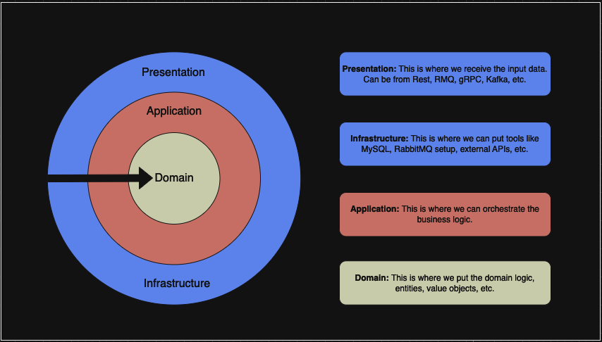

<p align="center">
    <h1 align="center">Quake III Arena Log Parser</h1>
<p align="center">
   <a href='https://github.com/diegoclair/log-parser/commits/main'>
	
   </a>
   <a href="https://github.com/diegoclair/log-parser/actions">
     
   </a>
  <a href='https://goreportcard.com/badge/github.com/diegoclair/log-parser'>
     
    </a>
<p>
  
## Description 
This project is a log parser for Quake III Arena, a popular first-person shooter game released in 1999. 

The parser can extract a variety of information from the game logs, including:
* From each match, it can extract:
   * Player names
   * Total kills by player
   * Total kills from match
   * Total deaths by it cause

### Key Features
* **Clean Architecture**: The project is designed using the principles of Clean Architecture, which promotes separation of concerns, modularity, and testability.
* **Comprehensive Parsing**: The parser can extract a wide range of information from the game logs.
* **Well-Tested**: All layers of the codebase are tested to ensure reliability and robustness.

### Project architecture:
<div align="center">
    
</div>

<br>
For the presentation layer, which I refer to as the transport layer, its purpose is to handle data transportation. It is responsible for receiving line text and send to application layer, where it will orchestrate the business logic.

### Result
The parsed data is written to a JSON file named `result.json`. This file contains information about each match, structured as follows:

```
{
  "game_001": {                        // Identifier for the match (e.g., "game_001")
        "total_kills": 11,             // Total number of kills in the match
        "players": [                   // List of players who participated
            "Isgalamido", 
            "Mocinha"
        ],
        "kills": {                     // Kills attributed to each player (can be negative for if killed by <world>)
            "Isgalamido": -2
            "Mocinha": 5
        },
        "kills_by_means": {            // Kills by means of damage (e.g., weapon types / death causes)
            "MOD_FALLING": 1,
            "MOD_ROCKET_SPLASH": 3,
            "MOD_TRIGGER_HURT": 7
        }
    },
}
``` 
## Observations:

* **Suicides**: Suicides (kills by the player on themself) are not currently counted for the player. But it is counted on game TotalKills. Ex:
   * `22:18 Kill: 2 2 7: Isgalamido killed Isgalamido by MOD_ROCKET_SPLASH`  
* **Change Name**: the parser currently tracks the player name used most recently during the match, as player names can change in-game.

## 💻 Getting Started 

### Prerequisites ❗
* An installation of Go 1.21.0 or later. For installation instructions, see [Installing Go](https://go.dev/doc/install).
* A log file from Game lll Arena

### ▶️ Launching the Application 
To execute the application, run the command bellow in the root path: 
```bash
make start
```
Once you see the message a log with `Execution time:`, then the program was executed.

### ▶️ Specifying a Log File Path:
By default, the application will use the `qgames.log` file located in the project repository. However, you can specify a different log file path using the logpath flag:
```bash
make start logpath=./somelocation/log.log
```
* The logpath flag allows you to specify the path to the Quake III Arena log file you want to parse.
* In this example, the application will use the file located at ./somelocation/log.log.
* You can use absolute or relative paths for the logpath flag.
* Ensure the specified file exists and has read permissions.

## Running tests
```bash
make tests
```